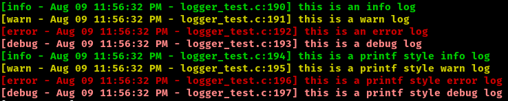

# ulog



`ulog` (uber log) is a lightweight and threadsafe logging library for C based programs. It features color coded output, with the ability to send logs to stdout and a file. File and line information indicating what fired the log is also included. It has INFO, WARN, ERROR, and DEBUG log levels, and is thoroughly tested with cmocka and valgrind.

# why another logging library?

I wanted a simple logging library that didnt leak memory, was well tested, and capable of color coded output. All logging libraries I found were complex code bases, leaked memory, and relied on global variables. Because of that, and as a way to better learn C development `ulog` was born.

# installation

To install you can simply copy and paste the `logger.h`, `colors.h`, `logger.c`, and `colors.c` files into whatever project you are working on.

# usage

The following code samples produce the output shown in the screenshot at the start of the readme.

## No File Logging

```C
#include <stdbool.H>
#include "logger.h"

thread_logger *thl = new_thread_logger(true);

LOG_INFO(thl, 0, "this is an info log");
LOG_WARN(thl, 0, "this is a warn log");
LOG_ERROR(thl, 0, "this is an error log");
LOG_DEBUG(thl, 0, "this is a debug log");

// the LOGF_ prefixed functions can be used for printf styled output
LOGF_INFO(thl, 0, "this is a %s style info log", "printf");
LOGF_WARN(thl, 0, "this is a %s style warn log", "printf");
LOGF_ERROR(thl, 0, "this is a %s style error log", "printf");
LOGF_DEBUG(thl, 0, "this is a %s style debug log", "printf");

// free up memory when you no longer need the logger
// note: after this returns thl is no logner safe to use
clear_thread_logger(thl);
```

## File Logging

```C
#include <stdbool.h>
#include "logger.h"


file_logger *fhl = new_file_logger("testfile.log", true);

LOG_INFO(fhl->thl, fhl->file_descriptor, "this is an info log");
LOG_WARN(fhl->thl, fhl->file_descriptor,"this is a warn log");
LOG_ERROR(fhl->thl, fhl->file_descriptor, "this is an error log");
LOG_DEBUG(fhl->thl, fhl->file_descriptor, "this is a debug log");

LOGF_INFO(fhl->thl, fhl->file_descriptor, "this is a %s style info log", "printf");
LOGF_WARN(fhl->thl, fhl->file_descriptor, "this is a %s style warn log", "printf");
LOGF_ERROR(fhl->thl, fhl->file_descriptor, "this is a %s style error log", "printf");
LOGF_DEBUG(fhl->thl, fhl->file_descriptor, "this is a %s style debug log", "printf");

clear_file_logger(fhl);
```

# license

AGPLv3 licensed, although if you want commercial license under MIT that can be aranged for a small fee.